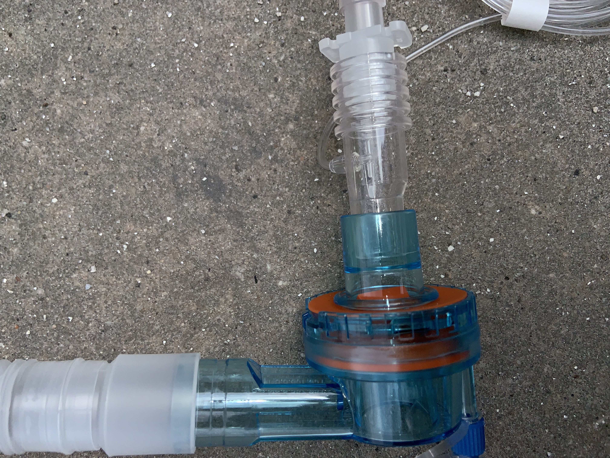
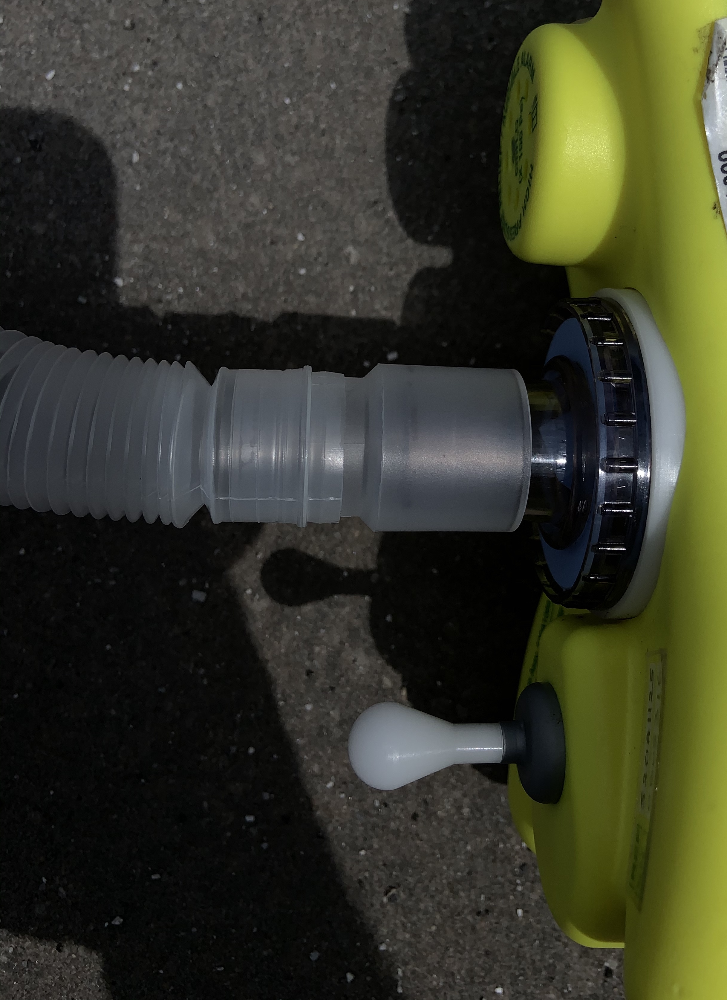
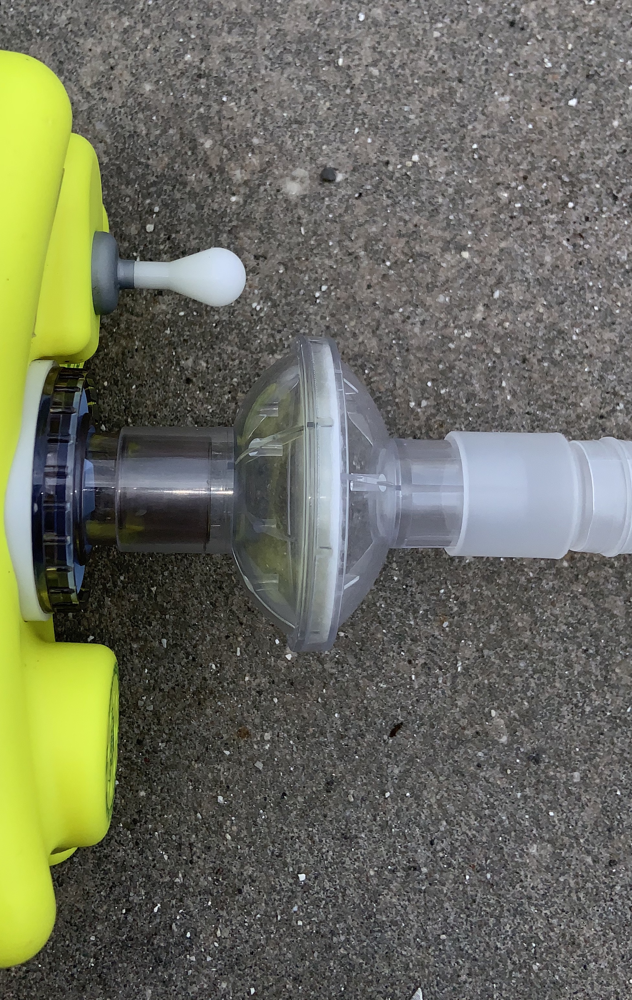
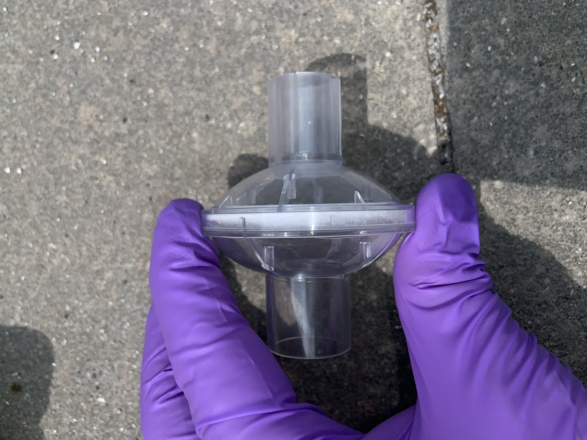
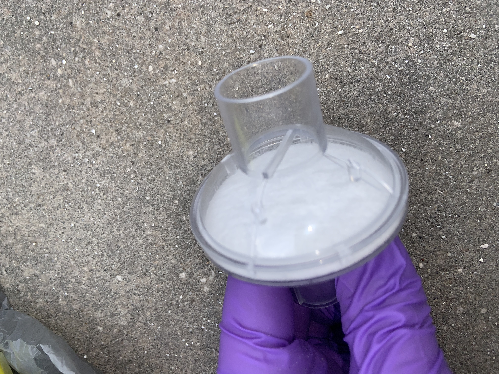
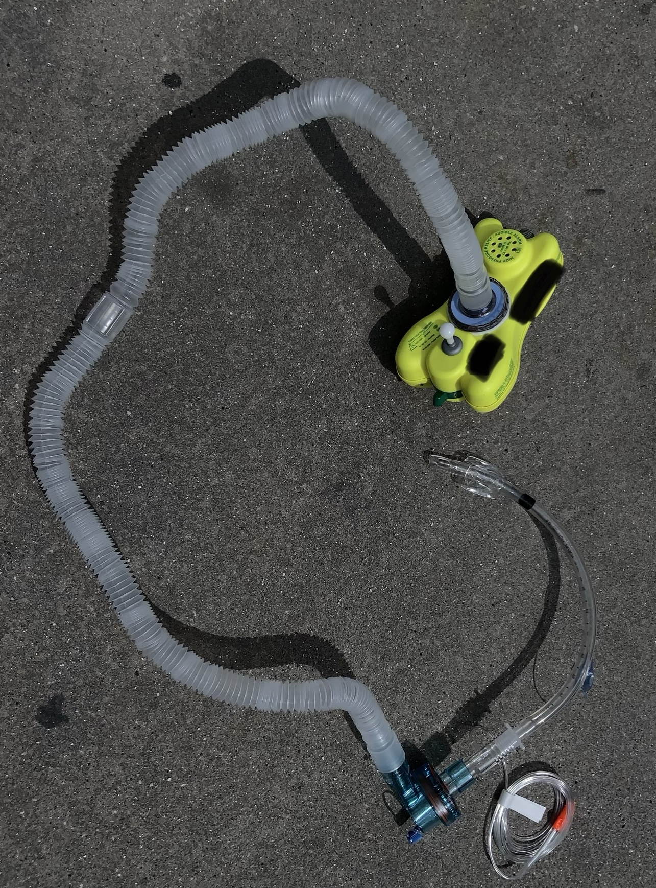

This repo is an attempt at developing an open source,3d printed viral filter intended to be used by paramedics to safely perform airway management on patients suspected of being contagious for infectious disease. The need for this product is being driven by the pandemic caused by the novel corona virus which causes the disease covid-19. These viral filters are attachments to our airway equipment that have not been previously neeeded, and have overnight become an essential piece of equipment for saving the lives of patients. This is a need shared by every EMS department across the world the provides ALS services. Because of the sudden need for this equipment, access to purchasing these items is non-existent.  
The design is simply a device that attaches to our airway eqiupment at two different points. As depicted in the images below is a traditional viral filter connected to a prehospital ventillator (yellow) on one end, and the ventillator circuit on the other end (the tubing that connects the ventillator to the breathing tube placed in the patient's airway). The 3d printed device is a meant only to hold a viral filter. These filters also are not available, as such we will be substituting with a either HEPA vacuum cleaner bags which filter particles of .3 microns and larger at 98.5% efficiency and greater. Other potential substitutes would be sacrifical n95 masks in the event they were in abundance.
If you would like to contribute your own design, clone master and create your own branch. As of this writing there is one branch with a working build file for a prototype. Development for that branch has been using Fusion360. If you would like to make a contribution to that branch, clone that branch and make a pull request with your design contributions.

